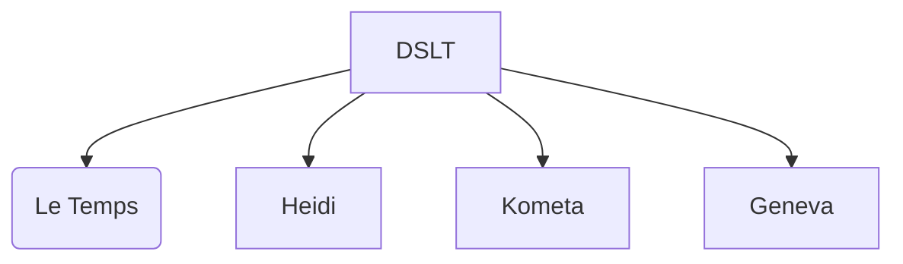
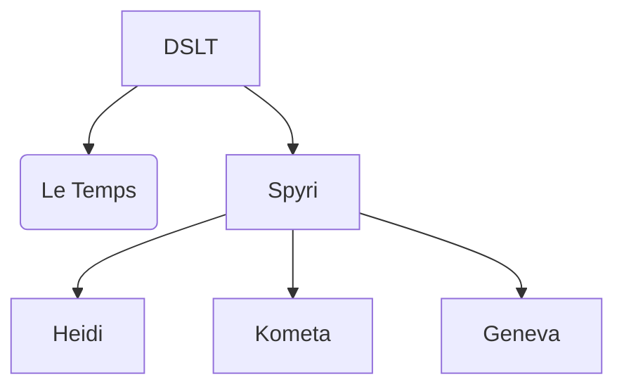

## Architecture

### DSLT (core system)

Les grandes règles et utilitaires CSS : 
- Grilles
- Typographique
- Couleurs sémantiques
- Gestion des icônes
- Breakpoints
- Espacements (4px)
- Composants

### Thèmes

Sans thème Spyri

Avec thème Spyri

## Arborescence 

### HTML

### CSS

