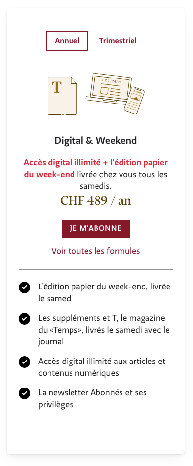

## Plan



```html {filename="HTML"}
<li class="card plan plan--switchable ">
  <div class="plan__switch">
    <div class="button button--switch js-switch-contract is-active" data-contract-id="13">
      Annuel
    </div>
    <div class="button button--switch js-switch-contract " data-contract-id="16">
      Trimestriel
    </div>
  </div>
  <div class="plan__image">
    
  </div>
  <h3 class="plan__title">
    Digital &amp; Weekend
  </h3>
  <div class="plan__description">
    <p><strong>Accès digital illimité + l'édition papier du week-end</strong> livrée chez vous tous les samedis.</p>
  </div>
  <div class="plan__body">
    <div class="plan__contract is-active" data-contract-id="13">
      <div class="plan__abo">
        <h4 class="plan__abo__title">
          1 an
        </h4>
        <span class="plan__abo__price">
          CHF 489 / an
        </span>
        <a class="button" data-event="click->trackLead" href="/abonnements/formules/LT-BC-DIGWE-1A">
          Je m'abonne
        </a>
      </div>
    </div>
    <div class="plan__contract " data-contract-id="16">
      <div class="plan__abo">
        <h4 class="plan__abo__title">
          3 mois
        </h4>
        <span class="plan__abo__price">
          CHF 135 / trimestre
        </span>
        <a class="button" data-event="click->trackLead" href="/abonnements/formules/LT-BC-DIGWE-3M">
          Je m'abonne
        </a>
      </div>
    </div>
    <a href="/abonnements/BC-DIGITAL-WEEKEND">Voir toutes les formules</a>
  </div>
  <ul class="plan__features-list">
    <li class="plan__feature">
      <svg xmlns="http://www.w3.org/2000/svg" viewBox="0 0 512 512">
        <path
          d="m256 512a256 256 0 1 0 0-512 256 256 0 1 0 0 512zm113-303-128 128c-9.4 9.4-24.6 9.4-33.9 0l-64-64c-9.4-9.4-9.4-24.6 0-33.9s24.6-9.4 33.9 0l47 47 111-111.1c9.4-9.4 24.6-9.4 33.9 0s9.4 24.6 0 33.9z">
        </path>
      </svg>
      L’édition papier du week-end, livrée le samedi<br></li>
    <li class="plan__feature">
      <svg xmlns="http://www.w3.org/2000/svg" viewBox="0 0 512 512">
        <path
          d="m256 512a256 256 0 1 0 0-512 256 256 0 1 0 0 512zm113-303-128 128c-9.4 9.4-24.6 9.4-33.9 0l-64-64c-9.4-9.4-9.4-24.6 0-33.9s24.6-9.4 33.9 0l47 47 111-111.1c9.4-9.4 24.6-9.4 33.9 0s9.4 24.6 0 33.9z">
        </path>
      </svg>
      Les suppléments et T, le magazine du «Temps», livrés le samedi avec le journal</li>
    <li class="plan__feature">
      <svg xmlns="http://www.w3.org/2000/svg" viewBox="0 0 512 512">
        <path
          d="m256 512a256 256 0 1 0 0-512 256 256 0 1 0 0 512zm113-303-128 128c-9.4 9.4-24.6 9.4-33.9 0l-64-64c-9.4-9.4-9.4-24.6 0-33.9s24.6-9.4 33.9 0l47 47 111-111.1c9.4-9.4 24.6-9.4 33.9 0s9.4 24.6 0 33.9z">
        </path>
      </svg>
      Accès digital illimité aux articles et contenus numériques</li>
    <li class="plan__feature">
      <svg xmlns="http://www.w3.org/2000/svg" viewBox="0 0 512 512">
        <path
          d="m256 512a256 256 0 1 0 0-512 256 256 0 1 0 0 512zm113-303-128 128c-9.4 9.4-24.6 9.4-33.9 0l-64-64c-9.4-9.4-9.4-24.6 0-33.9s24.6-9.4 33.9 0l47 47 111-111.1c9.4-9.4 24.6-9.4 33.9 0s9.4 24.6 0 33.9z">
        </path>
      </svg>
      La newsletter Abonnés et ses privilèges</li>
  </ul>
</li>
```
Le svg est inline, il devrait être externe
Le svg est répété 4 fois
Le svg est non signifiant, il ne devrait pas être dans le DOM du tout


## Teaser


```html {filename="HTML"}
<div class="post-subscribe post-subscribe--paying">
  <div class="card">
    <h3 class="post-subscribe__title is-h2">Cet article vous intéresse?</h3>
    <p>Ne manquez aucun de nos contenus publiés quotidiennement - abonnez-vous dès maintenant pour accéder à tous nos
      articles, dossiers, et analyses</p>
    <a class="button is-secondary" href="/abonnements">CONSULTER LES OFFRES</a>
    <div class="post-subscribe__arguments">
      <picture class="post-subscribe__arguments__image">
        
      </picture>
      <div>
        <h4>Les bonnes raisons de s’abonner au Temps:</h4>
        <ul>
          <li>
            <svg xmlns="http://www.w3.org/2000/svg" viewBox="0 0 512 512" class="icon">
              <path d="m256 512a256 256 0 1 0 0-512 256 256 0 1 0 0 512zm113-303-128 128c-9.4 9.4-24.6 9.4-33.9 0l-64-64c-9.4-9.4-9.4-24.6 0-33.9s24.6-9.4 33.9 0l47 47 111-111.1c9.4-9.4 24.6-9.4 33.9 0s9.4 24.6 0 33.9z"></path>
            </svg>
            Consultez tous les contenus en illimité sur le site et l’application mobile
          </li>
          <li>
            <svg xmlns="http://www.w3.org/2000/svg" viewBox="0 0 512 512" class="icon">
              <path d="m256 512a256 256 0 1 0 0-512 256 256 0 1 0 0 512zm113-303-128 128c-9.4 9.4-24.6 9.4-33.9 0l-64-64c-9.4-9.4-9.4-24.6 0-33.9s24.6-9.4 33.9 0l47 47 111-111.1c9.4-9.4 24.6-9.4 33.9 0s9.4 24.6 0 33.9z"></path>
            </svg>
            Accédez à l’édition papier en version numérique avant 7 heures du matin
          </li>
          <li>
            <svg xmlns="http://www.w3.org/2000/svg" viewBox="0 0 512 512" class="icon">
              <path d="m256 512a256 256 0 1 0 0-512 256 256 0 1 0 0 512zm113-303-128 128c-9.4 9.4-24.6 9.4-33.9 0l-64-64c-9.4-9.4-9.4-24.6 0-33.9s24.6-9.4 33.9 0l47 47 111-111.1c9.4-9.4 24.6-9.4 33.9 0s9.4 24.6 0 33.9z"></path>
            </svg>
            Bénéficiez de privilèges exclusifs réservés aux abonnés
          </li>
          <li>
            <svg xmlns="http://www.w3.org/2000/svg" viewBox="0 0 512 512" class="icon">
              <path d="m256 512a256 256 0 1 0 0-512 256 256 0 1 0 0 512zm113-303-128 128c-9.4 9.4-24.6 9.4-33.9 0l-64-64c-9.4-9.4-9.4-24.6 0-33.9s24.6-9.4 33.9 0l47 47 111-111.1c9.4-9.4 24.6-9.4 33.9 0s9.4 24.6 0 33.9z"></path>
            </svg>
            Accédez aux archives
          </li>
        </ul>
      </div>
    </div>
    <p class="post-subscribe__login">
      <span>Déjà abonné(e) ?</span>
      <a class="link" rel="nofollow" href="https://www.letemps.ch/compte/connexion?return_to=https%3A%2F%2Fwww.letemps.ch%2Fsociete%2Fcomment-le-porno-banalise-la-violence-et-detruit-l-amour">
        Se connecter
      </a>
    </p>
  </div>
</div>
```
Le svg est inline, il devrait être externe
Le svg est répété 4 fois
Le svg est non signifiant, il ne devrait pas être dans le DOM du tout
Le h3 nuit au plan
La classe `is-h2` est non sémantique, et troublante
La classe `link` sur une balise `a` est inutile

## Bouton


```html {filename="HTML"}
<a class="button is-small is-secondary is-desktop" href="/abonnements">S'abonner</a>
```
La classe `is-desktop` est dénuée de sens
