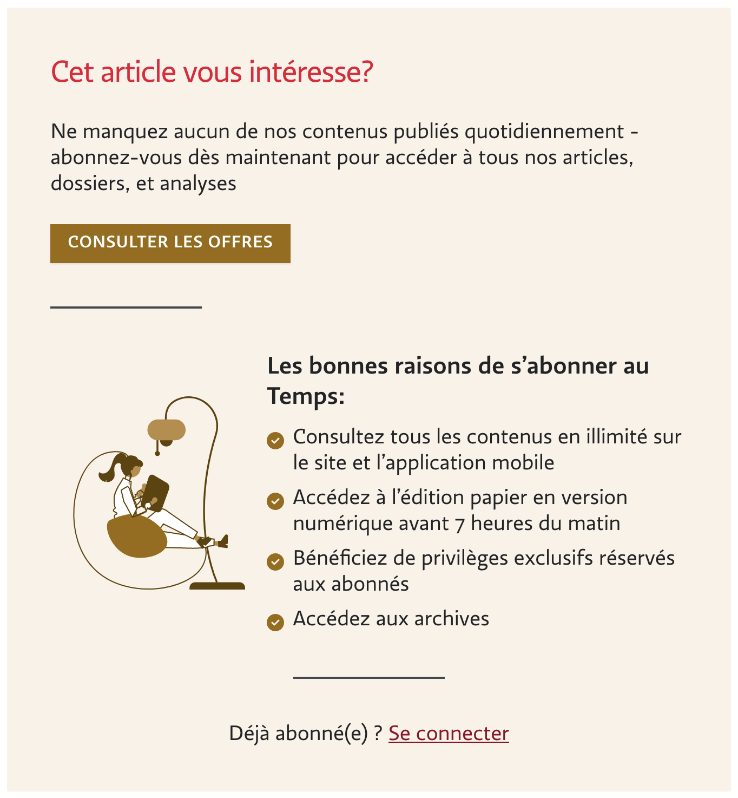

## Page


```html {filename="HTML"}
<section class="width-limiter">
  <ul class="plans-list">
    <li class="card plan plan--switchable "></li>
    <li class="card plan plan--switchable plan--popular"></li>
    <li class="card plan plan--switchable "></li>
  </ul>
</section>
```
Le balisage est partiellement visuel `card`, partiellement sémantique `plan`
L'utilisation de `--switchable` et `--popular` utilisent la syntaxe BEM, mais `--switchable` pose question. Est-ce vraiment un modifier ? Si tous les plans sont switchable, pourquoi le spécifier ?


Le plan du document n'a aucun sens. Les titres de niveau 3 devraient être des titres de niveau 2, et les titres 2 du footer ne devraient pas apparaître.

## Plan


```html {filename="HTML"}
<li class="card plan plan--switchable ">
  <div class="plan__switch">
    <div class="button button--switch js-switch-contract is-active" data-contract-id="13">
      Annuel
    </div>
    <div class="button button--switch js-switch-contract " data-contract-id="16">
      Trimestriel
    </div>
  </div>

  <div class="plan__image">
    
  </div>
  <h3 class="plan__title">
    Digital &amp; Weekend
  </h3>
  <div class="plan__description">
    <p><strong>Accès digital illimité + l'édition papier du week-end</strong> livrée chez vous tous les samedis.</p>
  </div>
  <div class="plan__body">
    <div class="plan__contract is-active" data-contract-id="13">

      <div class="plan__abo">
        <h4 class="plan__abo__title">
          1 an
        </h4>
        <span class="plan__abo__price">
          CHF 489 / an
        </span>
        <a class="button" data-event="click->trackLead" href="/abonnements/formules/LT-BC-DIGWE-1A">
          Je m'abonne
        </a>
      </div>

    </div>
    <div class="plan__contract " data-contract-id="16">

      <div class="plan__abo">
        <h4 class="plan__abo__title">
          3 mois
        </h4>
        <span class="plan__abo__price">
          CHF 135 / trimestre
        </span>
        <a class="button" data-event="click->trackLead" href="/abonnements/formules/LT-BC-DIGWE-3M">
          Je m'abonne
        </a>
      </div>

    </div>
    <a href="/abonnements/BC-DIGITAL-WEEKEND">Voir toutes les formules</a>
  </div>
  <ul class="plan__features-list">
    <li class="plan__feature"><svg xmlns="http://www.w3.org/2000/svg" viewBox="0 0 512 512">
        <path
          d="m256 512a256 256 0 1 0 0-512 256 256 0 1 0 0 512zm113-303-128 128c-9.4 9.4-24.6 9.4-33.9 0l-64-64c-9.4-9.4-9.4-24.6 0-33.9s24.6-9.4 33.9 0l47 47 111-111.1c9.4-9.4 24.6-9.4 33.9 0s9.4 24.6 0 33.9z">
        </path>
      </svg>
      L’édition papier du week-end, livrée le samedi<br></li>
    <li class="plan__feature"><svg xmlns="http://www.w3.org/2000/svg" viewBox="0 0 512 512">
        <path
          d="m256 512a256 256 0 1 0 0-512 256 256 0 1 0 0 512zm113-303-128 128c-9.4 9.4-24.6 9.4-33.9 0l-64-64c-9.4-9.4-9.4-24.6 0-33.9s24.6-9.4 33.9 0l47 47 111-111.1c9.4-9.4 24.6-9.4 33.9 0s9.4 24.6 0 33.9z">
        </path>
      </svg>
      Les suppléments et T, le magazine du «Temps», livrés le samedi avec le journal</li>
    <li class="plan__feature"><svg xmlns="http://www.w3.org/2000/svg" viewBox="0 0 512 512">
        <path
          d="m256 512a256 256 0 1 0 0-512 256 256 0 1 0 0 512zm113-303-128 128c-9.4 9.4-24.6 9.4-33.9 0l-64-64c-9.4-9.4-9.4-24.6 0-33.9s24.6-9.4 33.9 0l47 47 111-111.1c9.4-9.4 24.6-9.4 33.9 0s9.4 24.6 0 33.9z">
        </path>
      </svg>
      Accès digital illimité aux articles et contenus numériques</li>
    <li class="plan__feature"><svg xmlns="http://www.w3.org/2000/svg" viewBox="0 0 512 512">
        <path
          d="m256 512a256 256 0 1 0 0-512 256 256 0 1 0 0 512zm113-303-128 128c-9.4 9.4-24.6 9.4-33.9 0l-64-64c-9.4-9.4-9.4-24.6 0-33.9s24.6-9.4 33.9 0l47 47 111-111.1c9.4-9.4 24.6-9.4 33.9 0s9.4 24.6 0 33.9z">
        </path>
      </svg>
      La newsletter Abonnés et ses privilèges</li>
  </ul>

</li>
```




