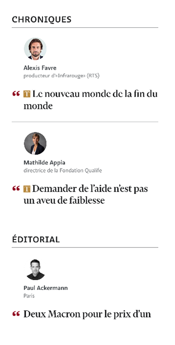
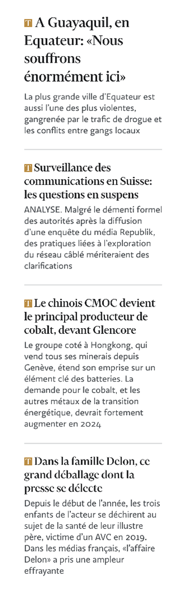
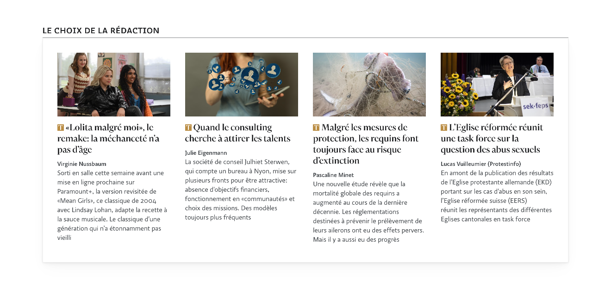
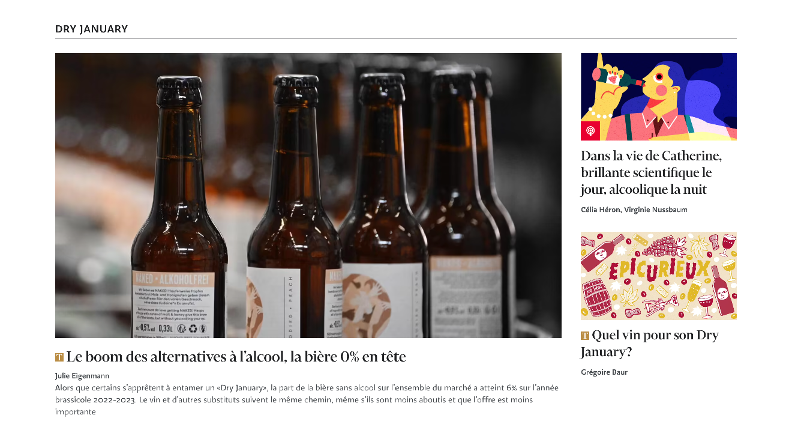
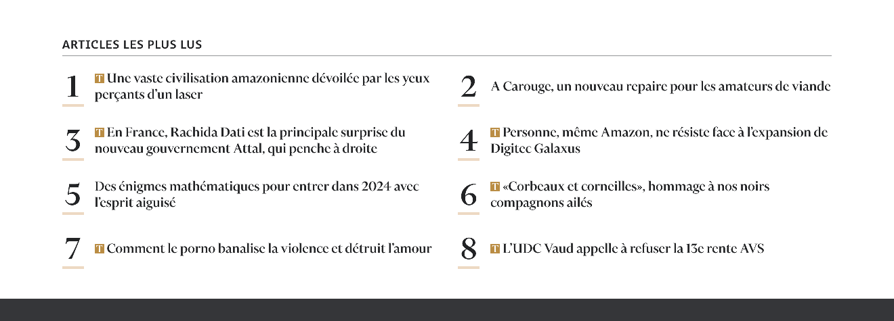

## À la une


```html {filename="HTML"}
<section class="home-section home-section--featured">
  <h2 class="home-section-title">À la une</h2>
  <ul class="articles is-mobile">...</ul>
  <ul class="articles featured-1">...</ul>
  <ul class="articles featured-2">...</ul>
  <aside class="home-section--aside">...</aside>
  <section class="home-section featured-3">...</section>
</section>
```

## Articles mobile

Non visible en desktop

```html {filename="HTML"}
<ul class="articles is-mobile">
  <li>
    <article class="post ">
      <div class="post__text">
        <h2 class="post__title">
          <svg xmlns="http://www.w3.org/2000/svg" viewBox="0 0 201.9 220.6" class="icon icon--premium">
            <title>Réservé aux abonnés</title>
            <path
              d="M201.9,57.8H199c-3.9-14.2-23.5-50.7-37.5-52.6a200.32,200.32,0,0,0-24.9-1.3H122.4v194c0,7.1,2.6,12.9,10,16.2,3.9,1.6,20.4,3.9,26.1,4.2v2.3H43.4v-2.3c5.8-.3,22-1.9,26.1-3.5,7.7-2.9,10-9.1,10-16.2V3.9H65.6A204.49,204.49,0,0,0,40.7,5.2C26.8,7.1,6.8,43.6,2.9,57.8H0V0H201.7l.2,57.8">
            </path>
          </svg>
          <a href="/monde/a-guayaquil-en-equateur-nous-souffrons-enormement-ici">A Guayaquil, en Equateur: «Nous souffrons énormément ici»</a>
        </h2>
        <div class="post__lead">
          <p>La plus grande ville d’Equateur est aussi l’une des plus violentes, gangrenée par le trafic de drogue et les conflits entre gangs locaux</p>
        </div>
      </div>
    </article>
  </li>
</ul>
```

## Articles aside



```html {filename="HTML"}
<aside class="home-section--aside">
  <section>
    <h2 class="home-section-title">
      Chroniques
    </h2>
    <ul class="articles">
      <li>
        <article class="post post-opinion">...</article>
      </li>
      <li>
        <article class="post post-opinion">...</article>
      </li>
    </ul>
  </section>
  <section>
    <h2 class="home-section-title">
      Éditorial
    </h2>
    <ul class="articles">
      <li>
        <article class="post post-opinion">...</article>
      </li>
    </ul>
  </section>
  <div id="adnz_halfpage_1" class="aside__adzn" data-adnz-effect-tag="ad:adnz_halfpage_1"></div>
</aside>
```

## Articles featured

Le composant `featured` existe en plusieurs largeurs, celle ci-dessous est `featured-1`.



```html {filename="HTML"}
<ul class="articles featured-1">
  <li>
    <article class="post ">... </article>
  </li>
  <li class="is-desktop">
    <article class="post ">...</article>
  </li>
  <li class="is-desktop">
    <article class="post ">...</article>
  </li>
</ul>
```


## Le choix de la rédaction



```html {filename="HTML"}
<section class="home-section featured-4">
  <h2 class="home-section-title">
    Le choix de la rédaction
  </h2>
  <div class="width-limiter">
    <ul class="articles featured-4 articles--boxed">
      <li>
        <article class="post ">...</article>
      </li>
      <li>
        <article class="post ">...</article>
      </li>
      <li>
        <article class="post ">...</article>
      </li>
      <li>
        <article class="post ">...</article>
      </li>
    </ul>
  </div>
</section>
```

## Flux



```html {filename="HTML"}
<section class="home-section home-section--flux home-section--teasers teasers--3">
  <h2 class="home-section-title">
    Dry January
  </h2>
  <div class="width-limiter">
    <ul class="articles">
      <li>
        <article class="post ">...</article>
      </li>
      <li>
        <article class="post ">...</article>
      </li>
      <li>
        <article class="post ">...</article>
      </li>
    </ul>
  </div>
</section>
```

## Articles les plus lus



```html {filename="HTML"}
<section class="home-section home-section--most-read">
  <header class="home-section__header">
    <h2 class="home-section-title">
      Articles les plus lus
    </h2>
  </header>
  <div class="width-limiter">
    <ol class="articles">
      <li>
        <article class="post ">...</article>
      </li>
      <li>
        <article class="post ">...</article>
      </li>
      <li>
        <article class="post ">...</article>
      </li>
      <li>
        <article class="post ">...</article>
      </li>
      <li>
        <article class="post ">...</article>
      </li>
      <li>
        <article class="post ">...</article>
      </li>
      <li>
        <article class="post ">...</article>
      </li>
      <li>
        <article class="post ">...</article>
      </li>
    </ol>
  </div>
</section>
```