## Analyse

Il y a une trentaine d'affichages différents pour les teasers. Une grande variété de tailles de titre, et des informations optionnelles à afficher.

Actuellement il y a au moins 17 fichiers partiels pour gérer ces différents affichages. À noter que certains sont simplement des "passe-plats".

```rb {filename="articles/templates/podcast/_preview.html.erb"}
<!-- defaults to defaults template -->
<%= render "articles/templates/default/preview", article: article %>
```

## Articles communs (20 styles différents en desktop)

### Titre 41/40 avec image, auteur et chapô


### Titre 28/32 avec chapô


### Titre 23/24 avec chapô


### Titre 20/24 avec chevron


### Titre 23/24 avec image, auteur et chapô


### Titre 23/24 avec auteur mis en avant


### Titre 23/24 avec image et catégorie


### Titre 23/24 avec image, auteur et chapô


### Titre 25/28 avec image et auteur


### Titre 28/32 avec image, auteur et chapô

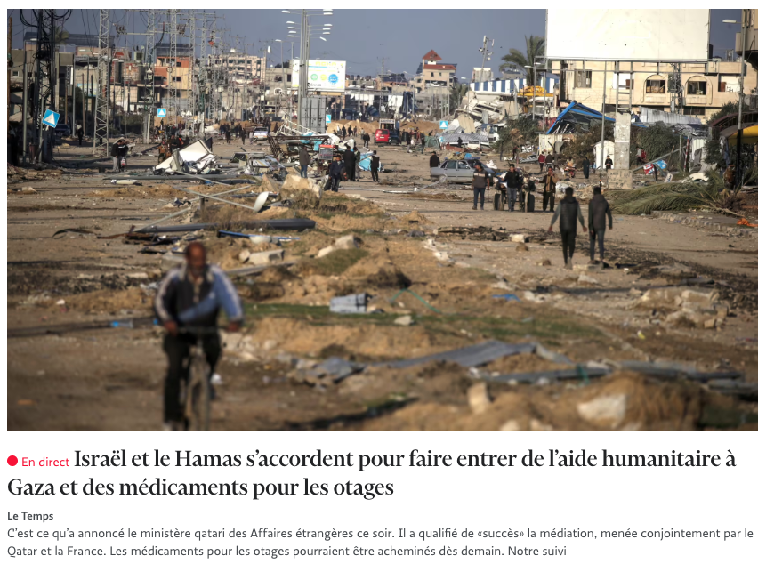

### Titre 23/24 mode classement

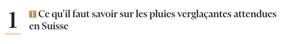

### Titre 20/24 mode classement

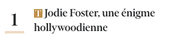

### Titre 25/28 avec image


### Titre 23/28


### Titre 46/44 avec image, chapô et date

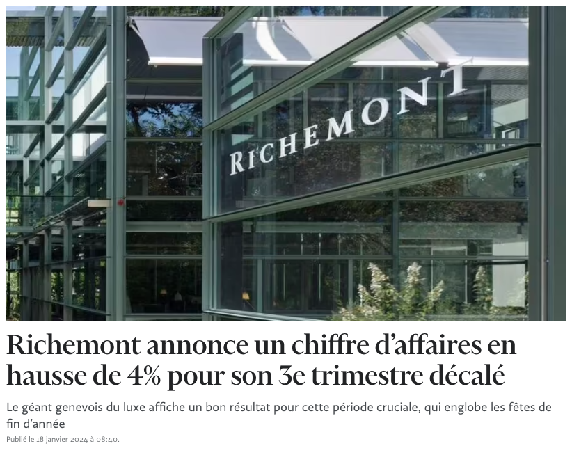

### Titre 20/24 avec image, chapô et date


### Titre 23/24 avec image et date


### Titre 23/24 avec image, heure et chapô

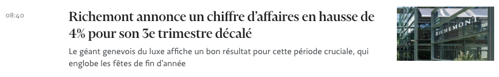

### Titre 23/24 avec image, auteur, chapô et date

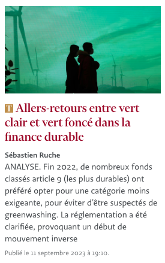

## Article Podcast

### Grand teaser accueil

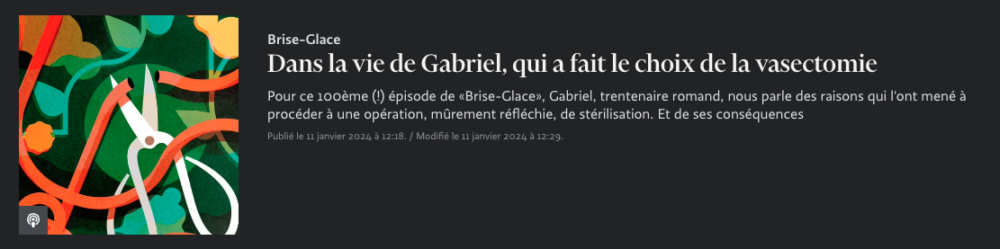

### Grand teaser index

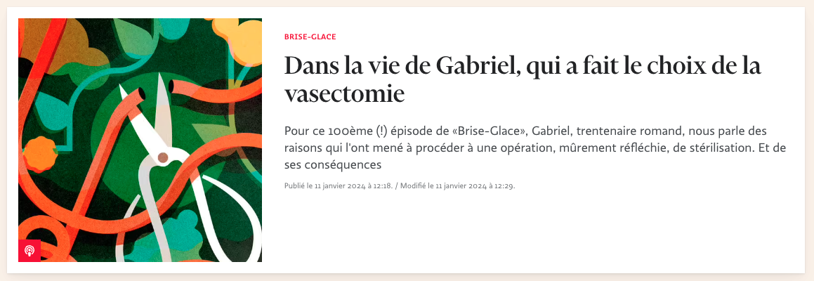

### Teaser grille

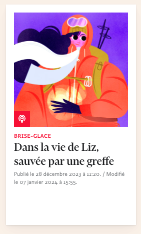

### Teaser liste

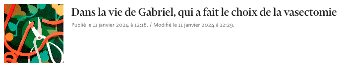

### Série simple

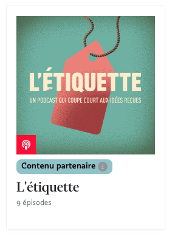

### Série petit format

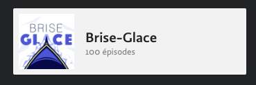

## Article Vidéo

### Vidéo très grand teaser


### Vidéo grand teaser


### Vidéo teaser grille


### Vidéo teaser liste


## Actuellement : des partiels très proches avec quelques variations

```html {filename="articles/templates/default/_preview.html.erb"}
<% article_title ||= article.title %>
<% cache article do %>
  <article class="post <%= sponsor_html_classes(article) %>">
    <% if article.photo %>
      <figure class="post__cover is-16-9" data-ariato="Article.Cover">
        <%= link_to article_canonical_path(article), title: article_title do %>
          <picture>
            <%= render 'articles/photo_sources_large', photo: article.photo %>
            " class="lazy" alt="<%= article.photo_caption if article.photo_caption.present? %>" />
          </picture>
        <% end %>
        <div class="post__meta">
          <%= render '/articles/post_genre_icon', article: article %>
        </div>
      </figure>
    <% end %>
    <div class="post__text">
      <%= render "articles/sponsors_small", sponsors: article.sponsors.commercial %>
      <h2 class="post__title">
        <% if article.is_active_live? %>
          <span class="post--live"><%= t("lives.article_label") %></span>
        <% elsif !article.photo %>
          <%= render '/articles/post_genre_icon', article: article %>
        <% end %>
        <% if !article.free %>
          <%= render 'articles/premium' %>
        <% end %>
        <%= link_to article_title, article_canonical_path(article) %>
      </h2>

      <%= render "articles/authors_list", article: article %>

      <% if article.description? %>
        <div class="post__lead"><%= markdown article.description %></div>
      <% end %>
      <time class="post__publication-date"><%= format_article_date article %></time>
      <%= render "articles/sponsors_small", sponsors: article.sponsors.not_commercial %>
    </div>
  </article>
<% end %>
```

```html {filename="articles/templates/default/_preview_small.html.erb"}
<!-- 2 differences with _preview: larger images + lead -->
<% cache article do %>
  <article class="post <%= sponsor_html_classes(article) %>">
    <% if article.photo %>
      <figure class="post__cover is-16-9" data-ariato="Article.Cover">
        <%= link_to article_canonical_path(article) do %>
          <picture>
            <%= render 'articles/photo_sources_small', photo: article.photo %>
            " class="lazy" alt="<%= article.photo_caption if article.photo_caption.present? %>" />
          </picture>
        <% end %>
        <div class="post__meta">
          <%= render '/articles/post_genre_icon', article: article %>
        </div>
      </figure>
    <% end %>
    <div class="post__text">
      <%= render "articles/sponsors_small", sponsors: article.sponsors.commercial %>
      <h2 class="post__title">
        <% if article.is_active_live? %>
          <span class="post--live"><%= t("lives.article_label") %></span>
        <% elsif !article.photo %>
          <%= render '/articles/post_genre_icon', article: article %>
        <% end %>
        <% if !article.free %>
          <%= render 'articles/premium' %>
        <% end %>
        <%= link_to article.title, article_canonical_path(article) %>
      </h2>

      <%= render "articles/authors_list", article: article %>   
      <time class="post__publication-date"><%= format_article_date article %></time>
      <%= render "articles/sponsors_small", sponsors: article.sponsors.not_commercial %>
    </div>
  </article>
<% end %>
```

```html {filename="articles/templates/default/_preview_dated.html.erb"}
<% cache article do %>
  <article class="post post-dated <%= sponsor_html_classes(article) %>">
    <aside>
      <time class="post__publication-date">
        <%= article.publication_date.to_s(:time) %>
      </time>
    </aside>
    <% if article.photo %>
      
      <figure class="post__cover is-16-9" data-ariato="Article.Cover">
        <%= link_to article_canonical_path(article) do %>
          <picture>
            <%= render 'articles/photo_sources_mini', photo: article.photo %>
            " class="lazy" alt="<%= article.photo_caption if article.photo_caption.present? %>" />
          </picture>
        <% end %>
        <div class="post__meta">
          <%= render '/articles/post_genre_icon', article: article %>
        </div>
      </figure>
    <% end %>
    <div class="post__text">
      <%= render "articles/sponsors_small", sponsors: article.sponsors.commercial %>
      <h2 class="post__title">
        <% if article.is_active_live? %>
          <span class="post--live"><%= t("lives.article_label") %></span>
        <% elsif !article.photo %>
          <%= render '/articles/post_genre_icon', article: article %>
        <% end %>
        <% if !article.free %>
          <%= render 'articles/premium' %>
        <% end %>
        <%= link_to article.title, article_canonical_path(article) %>
      </h2>
      <% if article.description? %>
        <div class="post__lead"><%= markdown article.description %></div>
      <% end %>      
      <%= render "articles/sponsors_small", sponsors: article.sponsors.not_commercial %>
    </div>
  </article>
<% end %>
```

## Solution

“Un partiel pour les gouverner tous.“

```html {filename="app/views/sites/letemps/articles/_teaser.html.erb"}
<% cache article do %>

  <% hide_photo ||= false %>
  <% photo_size ||= 'medium' %>
  <% hide_description ||= false %>
  <% show_date ||= false %>
  <% show_time ||= false %>
  <% show_authors ||= false %>
  <% show_category ||= false %>

  <% item_class = article.free ? "" : "article-item--premium" %>

  <article class="article-item <%= item_class %>">

    <h3><%= link_to article, article_canonical_path(article) %></h3>

    <% if show_date %>
      <time class="article-item__date" datetime="<%= article.publication_date %>">
        <%= format_article_date article %>
      </time>
    <% end %>

    <% if show_time %>
      <time class="article-item__date" datetime="<%= article.publication_date %>">
        <%= article.publication_date.to_s(:time) %>
      </time>
    <% end %>

    <% if show_category && article.category %>
      <div class="article-item__category">
        <%= link_to article.category, url_for_category(article.category) %>
      </div>
    <% end %>

    <% if show_authors %>
      <%= render "authors/list", article: article %>
    <% end %>

    <% if !hide_description && article.description %>
      <div class="article-item__description">
        <%= markdown article.description %>
      </div>
    <% end %>

    <% if !hide_photo && article.photo %>
      <%= render 'photos/photo', photo: article.photo, size: photo_size %>
    <% end %>

  </article>
<% end %>

```

### Utilisation 

```html
<%= render 'articles/article', 
    article: block.article,
    hide_description: true,
    hide_image: true,
    image_size: small, # small | medium | large
    show_authors: true,
    show_category: true,
    show_date: true,
    show_time: true
    %>
```

```scss
.article-item
  display: flex
  flex-direction: column
  position: relative
  figure
    order: -2
    img
      background: $color-background-alt
  picture
    aspect-ratio: 16/9
    margin-bottom: space(3)
    img
      width: 100%
      height: 100%
      object-fit: cover
      display: block
  h3
    @extend %heading-06
    margin-bottom: 0
    a
      @include stretched-link
      text-decoration: none
      &:hover
        color: $color-accent
  &__description
    @extend %body-text
    color: $color-text-alt
    margin-top: space(2)
  &__authors
    margin-top: space(3)
    margin-bottom: space(1)
    color: $color-text-alt
    + .article-item__description
      margin-top: 0
  &__category
    @extend %label-02-cap
    color: $color-accent
    order: -1
  &--premium
    h3
      @include icon(t)
  @include media-breakpoint-down(desktop)
    flex-direction: row-reverse
    gap: space(4)
    flex-wrap: wrap
    row-gap: 0
    h3
      flex: 1
    figure
      width: col(4.5)
      picture
        margin-bottom: 0
    .article-item__authors
      order: 2
```