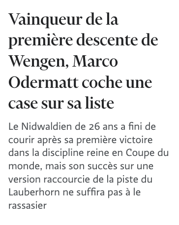
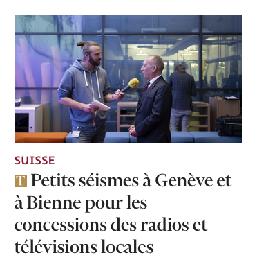
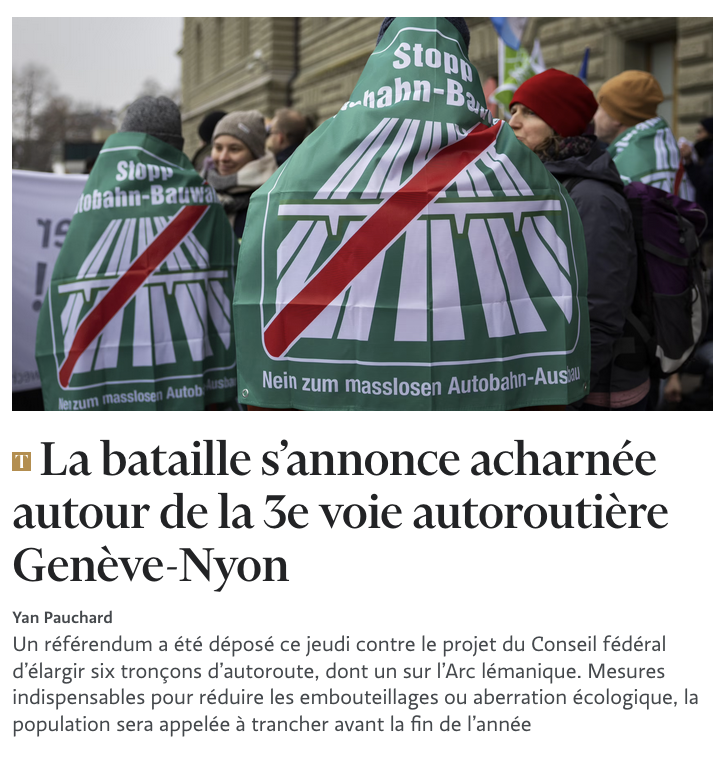

## Sans texte




```html {filename="HTML"}
<article class="post post-opinion">
  <div class="post__authors">
    <div class="post__author">
      <a href="/profil/alexis-favre-1">
        <figure class="avatar is-1-1" data-ariato="Article.Cover">
          <picture>
            
          </picture>
        </figure>
      </a> <a href="/profil/alexis-favre-1">Alexis Favre</a>
      <small>producteur d'«Infrarouge» (RTS)</small>
    </div>
  </div>
  <h3 class="post__title">
    <svg xmlns="http://www.w3.org/2000/svg" viewBox="0 0 201.9 220.6" class="icon icon--premium">
      <title>Réservé aux abonnés</title>
      <path
        d="M201.9,57.8H199c-3.9-14.2-23.5-50.7-37.5-52.6a200.32,200.32,0,0,0-24.9-1.3H122.4v194c0,7.1,2.6,12.9,10,16.2,3.9,1.6,20.4,3.9,26.1,4.2v2.3H43.4v-2.3c5.8-.3,22-1.9,26.1-3.5,7.7-2.9,10-9.1,10-16.2V3.9H65.6A204.49,204.49,0,0,0,40.7,5.2C26.8,7.1,6.8,43.6,2.9,57.8H0V0H201.7l.2,57.8">
      </path>
    </svg>
    <a href="/opinions/chroniques/le-nouveau-monde-de-la-fin-du-monde">Le nouveau monde de la fin du
      monde</a>
  </h3>
</article>
```



