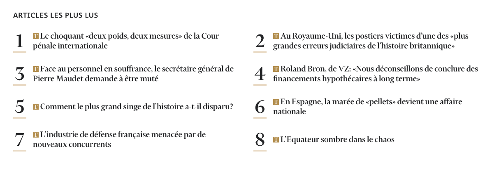
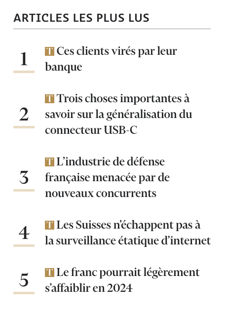

```html {filename="HTML"}
<section class="home-section home-section--most-read">
  <header class="home-section__header">
    <h2 class="home-section-title">
      Articles les plus lus
    </h2>
  </header>
  <div class="width-limiter">
    <ol class="articles">
      <li><article class="post">...</article></li>
      <li><article class="post">...</article></li>
      <li><article class="post">...</article></li>
      <li><article class="post">...</article></li>
      <li><article class="post">...</article></li>
      <li><article class="post">...</article></li>
      <li><article class="post">...</article></li>
      <li><article class="post">...</article></li>
      <li><article class="post">...</article></li>
      <li><article class="post">...</article></li>
    </ol>
  </div>
</section>
```



```html {filename="HTML"}
<section class="aside__section">
  <h2 class="aside__section__title">
    Articles les plus lus
  </h2>
  <ol class="articles">
    <li><article class="post">...</article></li>
    <li><article class="post">...</article></li>
    <li><article class="post">...</article></li>
    <li><article class="post">...</article></li>
    <li><article class="post">...</article></li>
  </ol>
</section>
```