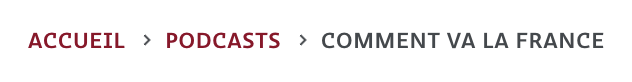
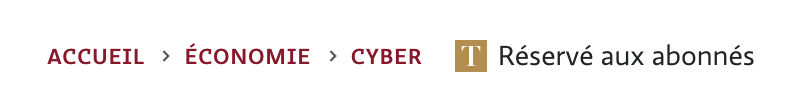

## Sans abonnement



```html {filename="HTML"}
<nav aria-label="Breadcrumb" class="breadcrumb">
  <ol>
    <li><a href="/">Accueil</a></li>
    <li><a href="https://www.letemps.ch/suisse">Suisse</a></li>
    <li><a href="https://www.letemps.ch/suisse/valais">Valais</a></li>
  </ol>
</nav>
```

`aria-label` devrait être en français
Il manque les microformats

## Avec abonnement



```html {filename="HTML"}
<nav aria-label="Breadcrumb" class="breadcrumb">
  <ol>
    <li><a href="/">Accueil</a></li>
    <li><a href="https://www.letemps.ch/opinions">Opinions</a></li>
    <li><a href="https://www.letemps.ch/opinions/revues-de-presse">Revues de presse</a></li>
    <li>
      <span class="post-premium is-long">
        <svg xmlns="http://www.w3.org/2000/svg" viewBox="0 0 201.9 220.6" class="icon icon--premium">
          <path d="M201.9,57.8H199c-3.9-14.2-23.5-50.7-37.5-52.6a200.32,200.32,0,0,0-24.9-1.3H122.4v194c0,7.1,2.6,12.9,10,16.2,3.9,1.6,20.4,3.9,26.1,4.2v2.3H43.4v-2.3c5.8-.3,22-1.9,26.1-3.5,7.7-2.9,10-9.1,10-16.2V3.9H65.6A204.49,204.49,0,0,0,40.7,5.2C26.8,7.1,6.8,43.6,2.9,57.8H0V0H201.7l.2,57.8"></path>
        </svg>
        <span>Réservé aux abonnés</span>
      </span>
    </li>
  </ol>
</nav>
```

Le fil d'ariane est cassé parce que "Réservé aux abonnés" n'en fait pas partie sur le plan sémantique. Cela a un effet de bord sur le dernier mot qui devrait être en gris, mais qui est en rouge.
Le svg alourdit le DOM pour rien, il devrait être externe et caché