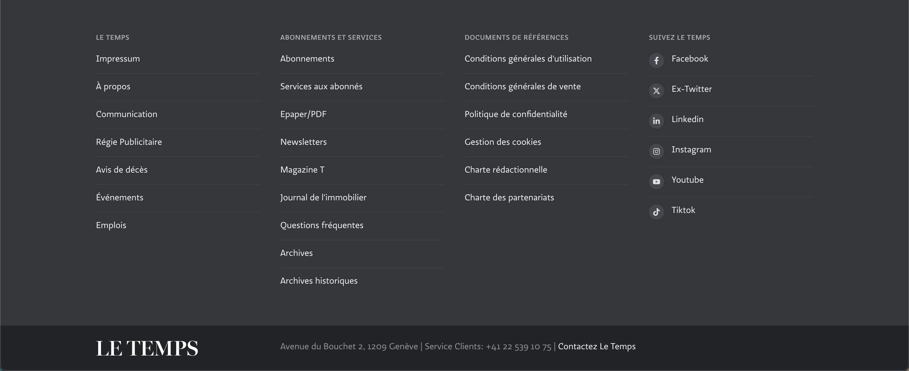
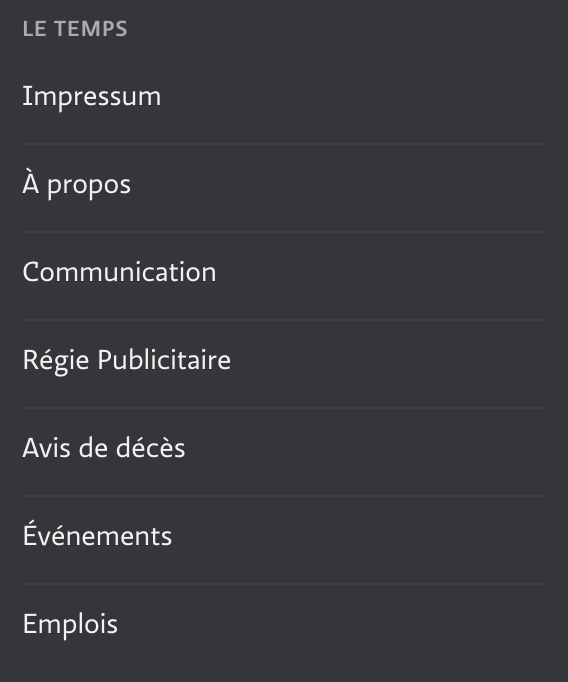

## Global



```html {filename="HTML"}
<footer class="site-footer">
  <div class="width-limiter">
    <nav class="footer-contact">
      <h2>le Temps</h2>
       ...
    </nav>
    <nav class="footer-contact">
      <h2>Abonnements et Services</h2>
       ...
    </nav>
    <nav class="footer-contact">
      <h2>Documents de références</h2>
       ...
    </nav>
    <nav class="footer-social">
    </nav>
  </div>
  <section class="footer-about">
  </section>
</footer>
```

## Menus contact
Le Temps, Abonnements et Services, Documents de références



```html {filename="HTML"}
<nav class="footer-contact">
  <h2>le Temps</h2>
  <ul>
    <li><a href="/impressum">Impressum</a></li>
    <li><a href="/a-propos">À propos</a></li>
    <li><a href="/communication">Communication</a></li>
    <li><a href="https://publicite.letemps.ch/" target="_blank" rel="noopener">Régie Publicitaire</a></li>
    <li><a href="https://publicite.letemps.ch/avis-de-deces/" target="_blank" rel="noopener">Avis de décès</a></li>
    <li><a target="_blank" rel="noopener" href="/evenements">Événements</a></li>
    <li><a href="/emplois">Emplois</a></li>
  </ul>
</nav>
```

## Menu social

```html {filename="HTML"}
<nav class="footer-social">
  <h2>Suivez Le Temps</h2>
  <ul>
    <li>
      <a href="https://www.facebook.com/letemps.ch/" target="_blank" title="Facebook" rel="noopener">
        <span class="icon">
          <svg xmlns="http://www.w3.org/2000/svg" viewBox="0 0 320 512"><path d="m279.14 288 14.22-92.66h-88.91v-60.13c0-25.35 12.42-50.06 52.24-50.06h40.42v-78.89s-36.68-6.26-71.75-6.26c-73.22 0-121.08 44.38-121.08 124.72v70.62h-81.39v92.66h81.39v224h100.17v-224z"></path></svg>
        </span>
        <span>Facebook</span>
      </a>
    </li>
    <li>
      <a href="https://twitter.com/@letemps" target="_blank" title="Twitter">
        <span class="icon">
          <svg xmlns="http://www.w3.org/2000/svg" viewBox="0 0 512 512"><!--! Font Awesome Pro 6.4.2 by @fontawesome - https://fontawesome.com License - https://fontawesome.com/license (Commercial License) Copyright 2023 Fonticons, Inc. --><path d="M389.2 48h70.6L305.6 224.2 487 464H345L233.7 318.6 106.5 464H35.8L200.7 275.5 26.8 48H172.4L272.9 180.9 389.2 48zM364.4 421.8h39.1L151.1 88h-42L364.4 421.8z"></path></svg>
        </span>
        <span>Ex-Twitter</span>
      </a>
    </li>
    <li>
      <a href="https://www.linkedin.com/company/le-temps/" target="_blank" title="Linkedin" rel="noopener">
        <span class="icon">
          <svg xmlns="http://www.w3.org/2000/svg" viewBox="0 0 448 512"><path d="m100.28 448h-92.88v-299.1h92.88zm-46.49-339.9c-29.7 0-53.79-24.6-53.79-54.3a53.79 53.79 0 0 1 107.58 0c0 29.7-24.1 54.3-53.79 54.3zm394.11 339.9h-92.68v-145.6c0-34.7-.7-79.2-48.29-79.2-48.29 0-55.69 37.7-55.69 76.7v148.1h-92.78v-299.1h89.08v40.8h1.3c12.4-23.5 42.69-48.3 87.88-48.3 94 0 111.28 61.9 111.28 142.3v164.3z"></path></svg>
        </span>
        <span>Linkedin</span>
      </a>
    </li>
    <li>
      <a href="https://www.instagram.com/letemps.ch/" target="_blank" title="Instagram" rel="noopener">
        <span class="icon">
          <svg xmlns="http://www.w3.org/2000/svg" viewBox="0 0 448 512"><path d="m224.1 141c-63.6 0-114.9 51.3-114.9 114.9s51.3 114.9 114.9 114.9 114.9-51.3 114.9-114.9-51.3-114.9-114.9-114.9zm0 189.6c-41.1 0-74.7-33.5-74.7-74.7s33.5-74.7 74.7-74.7 74.7 33.5 74.7 74.7-33.6 74.7-74.7 74.7zm146.4-194.3c0 14.9-12 26.8-26.8 26.8-14.9 0-26.8-12-26.8-26.8s12-26.8 26.8-26.8 26.8 12 26.8 26.8zm76.1 27.2c-1.7-35.9-9.9-67.7-36.2-93.9-26.2-26.2-58-34.4-93.9-36.2-37-2.1-147.9-2.1-184.9 0-35.8 1.7-67.6 9.9-93.9 36.1s-34.4 58-36.2 93.9c-2.1 37-2.1 147.9 0 184.9 1.7 35.9 9.9 67.7 36.2 93.9s58 34.4 93.9 36.2c37 2.1 147.9 2.1 184.9 0 35.9-1.7 67.7-9.9 93.9-36.2 26.2-26.2 34.4-58 36.2-93.9 2.1-37 2.1-147.8 0-184.8zm-47.8 224.5c-7.8 19.6-22.9 34.7-42.6 42.6-29.5 11.7-99.5 9-132.1 9s-102.7 2.6-132.1-9c-19.6-7.8-34.7-22.9-42.6-42.6-11.7-29.5-9-99.5-9-132.1s-2.6-102.7 9-132.1c7.8-19.6 22.9-34.7 42.6-42.6 29.5-11.7 99.5-9 132.1-9s102.7-2.6 132.1 9c19.6 7.8 34.7 22.9 42.6 42.6 11.7 29.5 9 99.5 9 132.1s2.7 102.7-9 132.1z"></path></svg>
        </span>
        <span>Instagram</span>
      </a>
    </li>
    <li>
      <a href="https://www.youtube.com/letemps" target="_blank" title="Youtube" rel="noopener">
        <span class="icon">
          <svg xmlns="http://www.w3.org/2000/svg" viewBox="0 0 576 512"><path d="m549.655 124.083c-6.281-23.65-24.787-42.276-48.284-48.597-42.59-11.486-213.371-11.486-213.371-11.486s-170.78 0-213.371 11.486c-23.497 6.322-42.003 24.947-48.284 48.597-11.412 42.867-11.412 132.305-11.412 132.305s0 89.438 11.412 132.305c6.281 23.65 24.787 41.5 48.284 47.821 42.591 11.486 213.371 11.486 213.371 11.486s170.78 0 213.371-11.486c23.497-6.321 42.003-24.171 48.284-47.821 11.412-42.867 11.412-132.305 11.412-132.305s0-89.438-11.412-132.305zm-317.51 213.508v-162.406l142.739 81.205z"></path></svg>
        </span>
        <span>Youtube</span>
      </a>
    </li>
    <li>
      <a href="https://www.tiktok.com/@letemps" target="_blank" title="Tiktok" rel="noopener">
        <span class="icon">
          <svg xmlns="http://www.w3.org/2000/svg" viewBox="0 0 448 512"><path d="m448 209.91a210.06 210.06 0 0 1 -122.77-39.25v178.72a162.55 162.55 0 1 1 -140.23-161.07v89.89a74.62 74.62 0 1 0 52.23 71.18v-349.38h88a121.18 121.18 0 0 0 1.86 22.17 122.18 122.18 0 0 0 53.91 80.22 121.43 121.43 0 0 0 67 20.14z"></path></svg>
        </span>
        <span>Tiktok</span>
      </a>
    </li>
  </ul>
</nav>
```

## Menu à propos

```html {filename="HTML"}
<section class="footer-about">
  <div class="width-limiter">
    <a href="/" class="logo" title="Le Temps">
      <svg xmlns="http://www.w3.org/2000/svg" viewBox="0 0 235 34.96" fill="#930025">
        <path d="M29.88,34.27v-.34a17.39,17.39,0,0,0,3.66-.54,2.13,2.13,0,0,0,1.52-2.31V4.17a2.27,2.27,0,0,0-1.52-2.45,14.27,14.27,0,0,0-3.66-.64V.74h27.6V8.89H57c-.63-2.21-3.76-7.07-6.06-7.37a43.82,43.82,0,0,0-4.59-.24H41.56V16.6h4.1c2.73,0,3.61-.89,4.2-1.53.88-.83,1.85-3.68,2-5h.48v13.8h-.48a13.58,13.58,0,0,0-2.06-5.2c-.63-.74-1.56-1.53-4.2-1.53h-4.1V29.36c0,3.83.83,4.32,5.52,4.32,3.08,0,6.35,0,7.53-1.12,1.71-1.78,4.3-6.49,5-8.1h.44l-.64,9.81H29.88"></path>
        <path d="M101.8,9.53h-.44c-.58-2.17-3.56-7.71-5.66-8a29.67,29.67,0,0,0-3.77-.2H89.78V30.84a2.44,2.44,0,0,0,1.52,2.45,23,23,0,0,0,4,.64v.34H77.82v-.34a23.9,23.9,0,0,0,4-.54,2.33,2.33,0,0,0,1.52-2.46V1.33h-2.1a31.36,31.36,0,0,0-3.76.2c-2.1.29-5.13,5.84-5.72,8h-.44V.74H101.8V9.53"></path>
        <path d="M102.8,34.27v-.34a17.49,17.49,0,0,0,3.67-.54A2.13,2.13,0,0,0,108,31.08V4.17a2.27,2.27,0,0,0-1.51-2.45,14.27,14.27,0,0,0-3.67-.64V.74h27.6V8.89h-.49c-.63-2.21-3.76-7.07-6.06-7.37a43.82,43.82,0,0,0-4.59-.25h-4.78V16.6h4.1c2.74,0,3.61-.89,4.2-1.53.88-.83,1.85-3.68,2-5h.49v13.8h-.49a13.72,13.72,0,0,0-2-5.2c-.64-.74-1.57-1.53-4.2-1.53h-4.1V29.36c0,3.83.83,4.32,5.52,4.32,3.07,0,6.35,0,7.51-1.12,1.72-1.78,4.31-6.49,5-8.1H133l-.64,9.81H102.8"></path>
        <path d="M177.53,34.27h-17.2v-.34a18,18,0,0,0,4.06-.59A2.58,2.58,0,0,0,166,30.83V3.49L153.64,33.73h-.88c-.49-1.52-1.71-5-2.49-6.82L140.4,4.23V26.47c0,3.78.54,5.55,1.62,6.48.82.68,4,.93,4.93,1v.34H133.57v-.34c.82-.1,3.32-.1,4.49-.94s1.56-2.75,1.56-6.48V6.38c0-2-.49-3.39-1.46-4.17a7.75,7.75,0,0,0-4.35-1.13V.74h11.87l10.7,24.15,8.16-20A16.3,16.3,0,0,0,165.61.74h11.87v.34a18.74,18.74,0,0,0-3.57.59,2.19,2.19,0,0,0-1.51,2.41V30.84a2.42,2.42,0,0,0,1.51,2.4,14.38,14.38,0,0,0,3.62.68v.35"></path>
        <path d="M194.79,19.2h-3.08V30.93a2.33,2.33,0,0,0,1.52,2.46,16.53,16.53,0,0,0,3.71.54v.35H180.09v-.35a19.91,19.91,0,0,0,3.61-.54,2.28,2.28,0,0,0,1.51-2.4V4.17a2.26,2.26,0,0,0-1.51-2.45A15.59,15.59,0,0,0,180,1.08V.74h16.95c6.89,0,11.33,2.8,11.33,8.15,0,7-6.64,10.31-13.48,10.31Zm-.54-17.82h-2.54V18.51h1.71c6.25,0,7.58-5.15,7.58-8.44,0-4.28-1.53-8.69-6.75-8.69Z"></path>
        <path d="M223.18,35a17.61,17.61,0,0,1-9.82-2.65l-1.62,2.4h-.49L211,22.83h.43c2.4,6.29,5.92,11.49,11.58,11.49,4.64,0,6.6-3.29,6.6-6.82,0-2.95-2-5.16-5.22-6.38-2.49-1-4.44-1.63-6.64-2.56a9.16,9.16,0,0,1-5.87-9.08c0-5.26,4.3-9.48,10.65-9.48a15.44,15.44,0,0,1,8.74,2.46L232.76.25h.49l.2,11.39H233c-1.85-5.75-4.79-11-10.4-11a5.62,5.62,0,0,0-5.67,5.58v.26c0,2.95,1.61,4.86,5,6.38,2.2,1,4.59,1.67,6.5,2.51,4,1.81,6.6,4,6.6,9.23,0,6-4.94,10.36-11.82,10.36"></path>
        <path d="M29.36,24.26l-.64,10H0v-.34a17.12,17.12,0,0,0,3.62-.54A2.28,2.28,0,0,0,5.13,31V4.17A2.33,2.33,0,0,0,3.62,1.72,13.49,13.49,0,0,0,0,1.08V.74H16.66v.34a17.33,17.33,0,0,0-3.52.39,2.25,2.25,0,0,0-1.51,2.46V29.32c0,3.92.87,4.37,5.51,4.37,3,0,5.67-.1,6.74-1.19A41.11,41.11,0,0,0,29,24.26h.39"></path>
      </svg>
    </a>
    <nav>
      <ul>
        <li>Avenue du Bouchet 2, 1209 Genève | Service Clients: +41 22 539 10 75 | <a href="/contact">Contactez Le Temps</a></li>
      </ul>
    </nav>
  </div>
</section>
```
