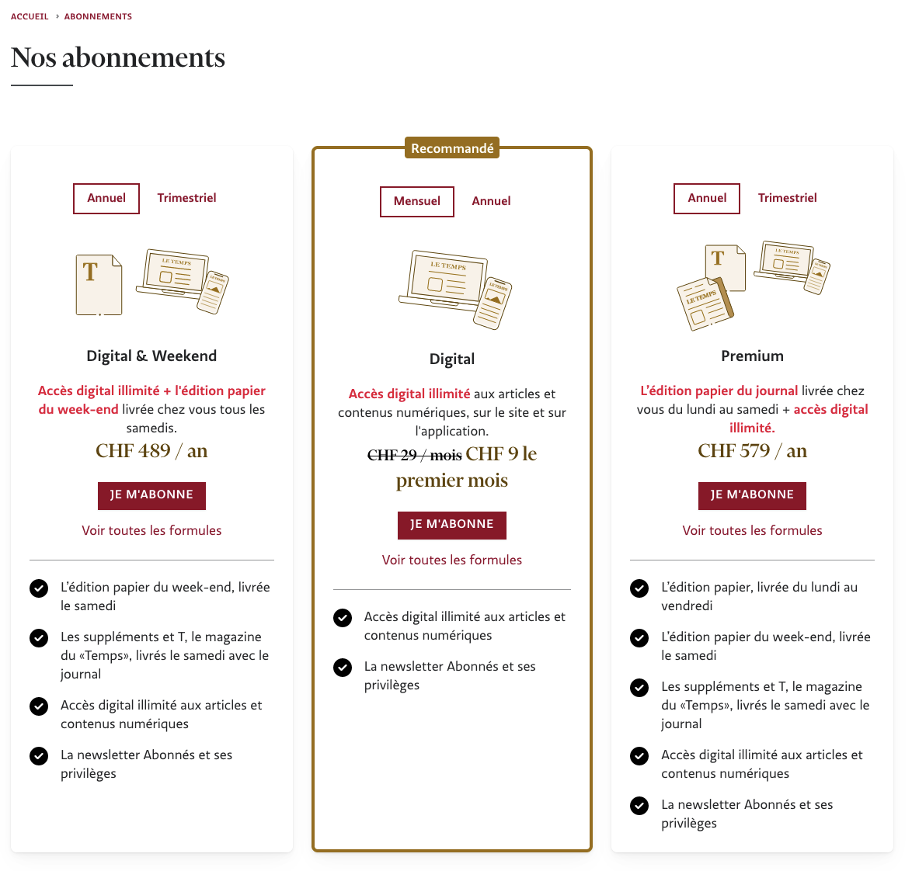
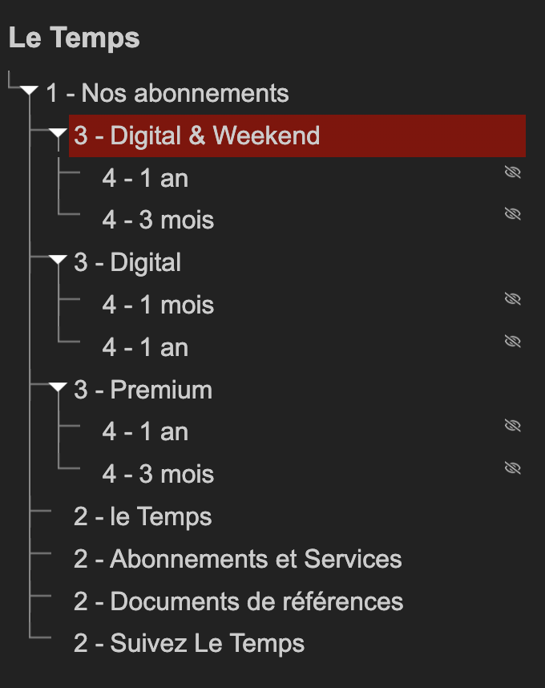
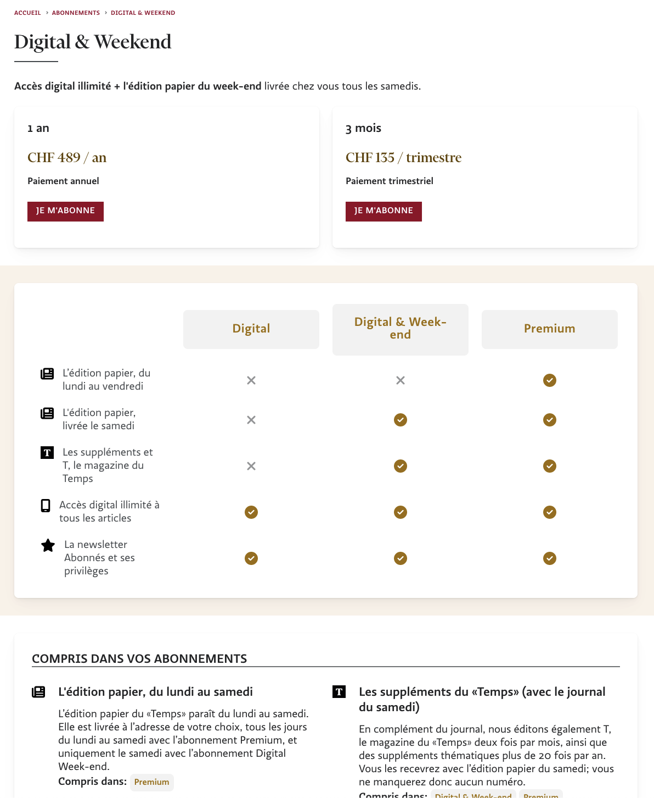

## Abonnements



```html {filename="HTML"}
<section class="width-limiter">
  <ul class="plans-list">
    <li class="card plan plan--switchable ">...</li>
    <li class="card plan plan--switchable plan--popular">...</li>
    <li class="card plan plan--switchable ">...</li>
  </ul>
</section>
```
Le balisage est partiellement visuel `card`, partiellement sémantique `plan`
L'utilisation de `--switchable` et `--popular` utilisent la syntaxe BEM, mais `--switchable` pose question. Est-ce vraiment un modifier ? Si tous les plans sont switchable, pourquoi le spécifier ?



Le plan du document n'a aucun sens. Les titres de niveau 3 devraient être des titres de niveau 2, et les titres 2 du footer ne devraient pas apparaître.

## Offre

