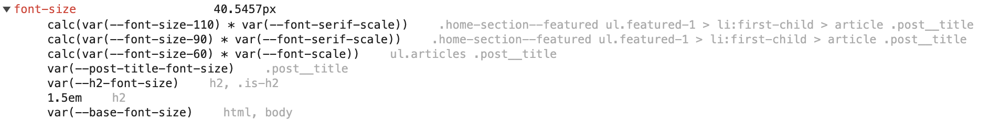

## Vues

### Imbrications

Exemple de structure sur la home.  
Sur Heidi on a quelque chose de relativement propre et cohérent : 
```
pages/index.html.erb
  -> render 'pages/home/featured_articles'
    -> render 'pages/home/featured_article'
      -> render 'articles/photo_sources'
      -> render 'articles/meta'
      -> render 'articles/premium'
    -> render 'pages/home/featured_article_nocover'
      -> render 'articles/meta'
      -> render 'articles/premium'
```

On voit ici que le `featured_article` et le `featured_article_nocover` pourraient être factorisés (on peut passer un paramètre 'cover: false' au partial featured_article), mais sinon la structure est plutôt logique.  

Sur Le Temps ça devient ça :
```
pages/index.html.erb
  -> render 'pages/home/featured_articles'
    -> render 'pages/home/featured_article_title_lead'
    -> render 'articles/photo_sources_large'
    -> render '/articles/post_genre_icon'
    -> render 'articles/premium'
    -> render "articles/authors_list"
    -> render "articles/sponsors_small"
    -> render 'pages/home/featured_article_small_image'
    -> render 'pages/home/featured_opinions_authors'
    -> render 'pages/home/featured_article_region
    -> render 'pages/home/featured_article'
      -> render "articles/templates/default/preview"
        -> render 'articles/photo_sources_large'
        -> render '/articles/post_genre_icon'
        -> render 'articles/premium'
        -> render "articles/authors_list"
        -> render "articles/sponsors_small"
```
et là on ne comprend plus rien. Les partial sont nommés en dehors du sens, avec des informations de taille ('large', 'small'). On à des niveaux différents les même inclusions. Bref on s'y perd !

### Répétitions

Sur les auteurs par exemple on a 3 partial différents :  `articles/authors_list`, `articles/authors_with_pictures`, `articles/authors`. Les 3 sont censés afficher une liste d'auteurs. Les 3 sont balisés `<div class="post__author">`. Visiblement c'est la même chose (afficher les auteurs) mais dans des contextes différents (avec plus ou moins de détails). Il faut factoriser.  
Même principe pour `articles/premium` et `articles/premium-text`.  
Sur Le Temps il y a beaucoup de partiels qui sont dupliqués alors qu'ils devraient "juste" être rendus plus intelligents (contextuels). Chaque duplication de partiel engendre des duplications de balisage et rendent le tout difficile à maintenir.

## DOM

### A11y
Menu - role aria menuitem faux sur tous les liens de liste de navigation
Menu - role aria "none" faut sur tous les list item de liste de navigation
Menu - Bouton de validation de la recherche caché et sans aria label (indétectable par un lecteur d'écran)
Menu - Mauvaise compréhension des rôles ARIA menu, menuitem et separator sur des éléments de navigation, ce qui contredit complétement l'information réel pour un lecteur d'écran
Menu - aria-label="secondary" --> le lecteur d'écran va lire "Secondary"

### Optimisations
- plan de la homepage
- plan de page article ?
- SVG inlines
- sections 
- balisage en “series” pour la page folder

## CSS

### Calculs 

Voilà un exemple de calcul de taille typographique pour un teaser.

Et voilà la pile de styles qui s'applique :


```css {filename="CSS"}
font-size: calc(var(--font-size-110) * var(--font-serif-scale));
```

Voilà les valeurs des variables ci-dessus :
```css {filename="CSS"}
--font-size-110: calc(var(--font-size-100) * var(--ratio));
--font-size-100: calc(var(--font-size-90) * var(--ratio));
--font-size-90: calc(var(--font-size-80) * var(--ratio));
--font-size-80: calc(var(--font-size-70) * var(--ratio));
--font-size-70: calc(var(--font-size-60) * var(--ratio));
--font-size-60: calc(var(--font-size-50) * var(--ratio));
--font-size-50: 1rem;
--font-serif-scale: 1;
--ratio: 1.125;
```

La taille en desktop est de 40.5457px.
Cette taille est le produit de 7 multiplications en cascade.
7 directives CSS sont empilées, dont 3 s'appuient sur le même type de calculs.


L'échelle modulaire ne correspond ni à un besoin graphique ni à un besoin technique, il suffit de l'enlever pour tout simplifier.



### Cloisonnements