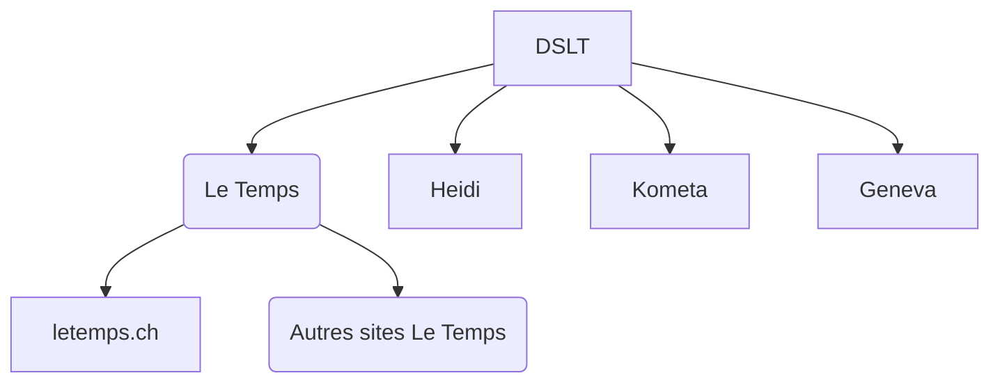
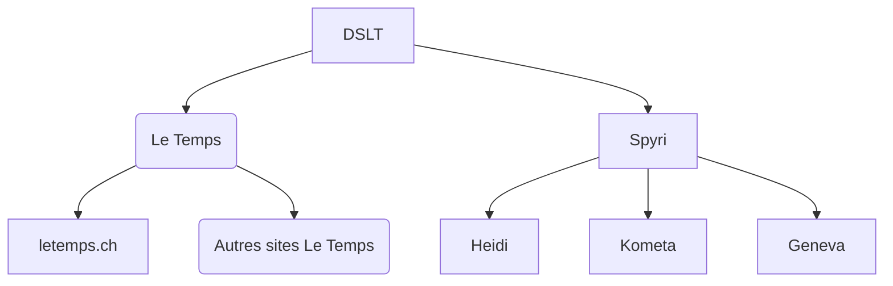


  Du système au site configuré.



  
  
  


## Architecture

### DSLT (core system)

Les grandes règles et utilitaires CSS : 
- Grilles
- Typographique
- Couleurs sémantiques
- Gestion des icônes
- Breakpoints
- Espacements (4px)
- Composants

### Thèmes

#### Sans thème Spyri
Approche pertinente s'il n'y a pas beaucoup de spécificités communes entre les 3 sites Heidi, Kometa et Geneva, au-dessus du DSLT.

#### Avec thème Spyri
Approche pertinente s'il y a un ensemble de spécificités à ajouter au DSLT et à utiliser dans les 3 sites Heidi, Kometa et Geneva.

## Arborescence 

### HTML

### CSS

## Ressources

- L'intégralité du design est disponible et visible sur [Figma](https://www.figma.com/file/TCIWZid2yVpz05VOt72Azq/DSLT?type=design&node-id=0%3A1&mode=design&t=m5UbnUNG4ewQNNdc-1).