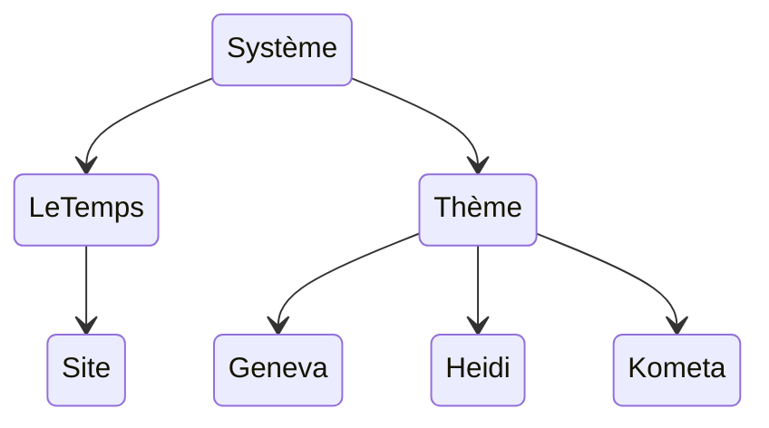

Il s'agit de regrouper à un niveau global toutes les règles et bonnes pratiques permettant de mettre en oeuvre les sites de l'écosystème Spyri. Figureront ici les fondamentaux, qu'ils soient issus de notre réflexion ou de la technique.

L'objectif est d'obtenir un ensemble, un **système** qui puisse s'appliquer aux deux thèmes de Spyri (le thème du Temps et celui par défaut) et faire fonctionner les sites avec une base respectable.

